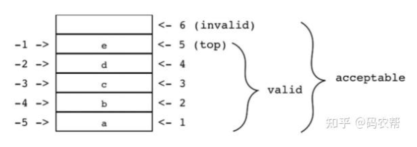
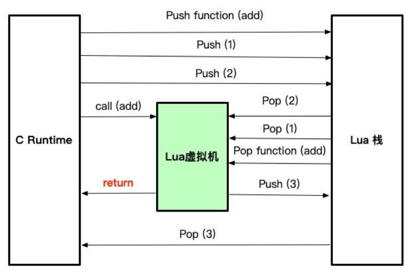
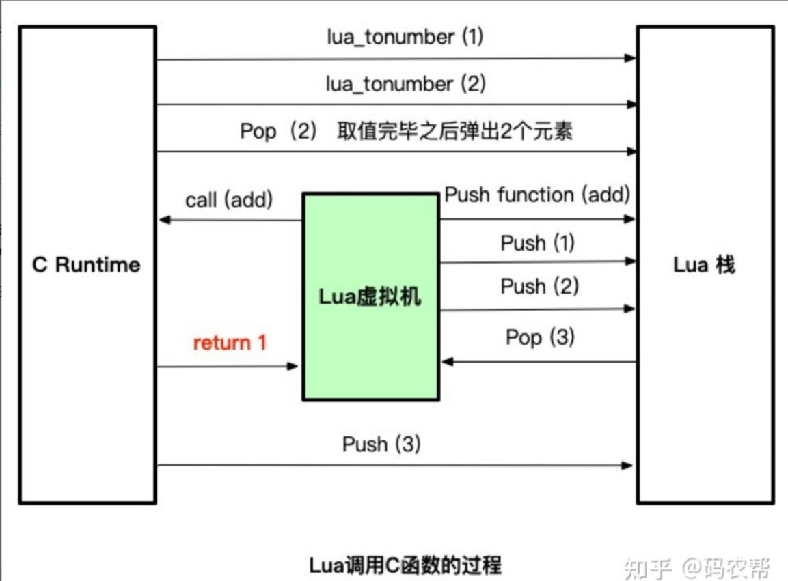

[Lua_CPP_2022](https://github.com/zincPower/Lua_CPP_2022)

[Lua与C在Android上的互调](https://zhuanlan.zhihu.com/p/672272489)

[常用lua c api ](https://www.cnblogs.com/sailJs/p/18715272)

## 例子

一个独立的解释器

```cpp
#include <iostream>
#include  <string>
#include <cstring>

#include <lua.hpp>

using namespace std;

int main() {
    char buff[256];
    int error;
    lua_State *L = luaL_newstate(); // 打开lua
    luaL_openlibs(L); // 打开lua标准库

    while (fgets(buff, sizeof(buff), stdin) != NULL) {
        // lual_loadsting 来编译用户输入的每一行内容
        // 程序调用函数 lua_pcall从战中弹出编译后的函数，并以保护模式运行 
        error = luaL_loadstring(L, buff) || lua_pcall(L, 0, 0, 0);
        if (error) {
            fprintf(stderr, "%s\n", lua_tostring(L, -1));
            lua_pop(L, 1); // 从栈中弹出错误信息
        }
    }

    lua_close(L);
    return 0;
}
```

```
a = 1 + 1024
print(a)
1025
```

## 栈



使用栈在Lua 和C之间交换数据。栈中的每个元素都能保存 Lua 中任意类型的值 。 当我们想要从Lua中获取一个值（例如一个全局变量的值）时，只需调用 Lua ,Lua 就会将指定的值压入栈中 。 当想要将一个值传给 Lua 时， 首先要将这个值压入栈，然后调用 Lua 将其从栈中弹出 即可。 

### Push操作

- lua_pushnil(lua_State*)：将nil推入堆栈
- lua_pushboolean(lua_State*, bool)：将一个布尔值压入到栈中
- lua_pushnumber(lua_State*, lua_Number)： 将双精度值压入栈中
- lua_pushinteger(lua_State*, lua_Integer)：将一个有符号的整数压入到栈中
- lua_pushstring (lua_State*, const char*)： 将一个字符串压入到栈中
- lua_pushlightuserdata(lua_State *L, void *p): 将一个指针压入到栈中

> ***注意：lua_pushstring压入一个字符串，Lua会创建自己的副本，因此一旦压入栈之后，你可以修改和释放之前的字符串对象。***

### 查询元素

第一个被压入栈的元素索引为1，第二个被压入栈的元素索引为2，依此类推。我们还可以以栈顶为参照 ，使用负数索引来访问栈中的元素。此时，－1表示栈顶元素（ 即最后被压入栈的元素），-2表示在它之前被压入栈的元素，依此类推。例如，调用lua_tostring(L,-1)会将栈顶的值作为字符串返回 。 

> ***注意，栈没有越界之说，如果指定的栈索引无效，取出来的值是nil***

- int lua_isnumber(lua_State*, int)：检查提供的索引处的元素是否为数字
- int lua_isstring(lua_State*, int)：检查提供的索引处的元素是否为字符串
- int lua_isboolean(lua_State*, int)：检查所提供索引处的元素是否为布尔值
- int lua_istable(lua_State*, int)：检查给定索引处的元素是否为表
- int lua_isnil(lua_State*, int)：检查给定索引处的元素是否为nil
- int lua_type(lua_State*, int)：返回类型的枚举值

```c
int lua_is*(lua_State *L, int index);
```

**其中lua_type返回的枚举值有：**

- LUA_TNUMBER：代表一个Lua数字类型
- LUA_TSTRING：代表一个Lua字符串类型
- LUA_TBOOLEAN：代表一个 Lua 布尔值类型
- LUA_TTABLE：代表一个Lua表类型
- LUA_TNIL：代表nil类型

### 取值

- lua_toboolean(lua_State*, int)：返回true或false
- lua_tonumber(lua_State*, int)：返回一个双精度值
- lua_tointeger(lua_State*, int)：返回一个有符号的整数值
- lua_tostring(lua_State*, int)：返回字符串，是一个`const char*`类型
- lua_gettop(lua_State*)：获得Lua栈顶元素的索引，**一般用于判断有函数有几个入参**

> ***针对lua_tostring弹出的字符串，可能会被Lua虚拟机回收，请拷贝成自己的副本。***

### 其他操作

```c
// 返回栈中元素的个数
int lua_gettop(lua_State *L);
// 修改栈中的元素数量 。 如果之前的栈顶比新设置的更高，那么高出来的这些元素就会被丢弃；反之，该函数会向栈中压人nil来补足大小。lua_settop(L, 0)用于清空栈
void lua_settop(lua_State *L, int index);
```

### 加载Lua脚本

Lua提供两种方式加载Lua脚本，一种通过`luaL_loadfile`，以文件的方式加载； 另外一种通过`luaL_loadstring`，以脚本字符串内容的方式加载。

### 内存分配

lual_newstate是一个用默认分配函数来创建 Lua状态的辅助函数。该默认分配函数使
用了来自C语言标准函数库的标准函数 malloc-realloc-free，对于大多数应用程序来说，
这几个函数（或应该是）够用了。但是，要完全控制Lua的内存分配也很容易，使用原始的
lua_newstate来创建我们自己的 Lua 状态即可。

### 操作表

[lua table操作实例详解](https://blog.csdn.net/qq_41286356/article/details/119419393)

```c
lua_gettable
lua_getglobal(L, "mytable") <== push mytable
lua_pushnumber(L, 1)        <== push key 1
lua_gettable(L, -2)         <== pop key 1, push mytable[1]

lua_settable
lua_getglobal(L, "mytable") <== push mytable
lua_pushnumber(L, 1)        <== push key 1
lua_pushstring(L, "abc")    <== push value "abc"
lua_settable(L, -3)         <== mytable[1] = "abc", pop key & value

lua_rawget:
用法同lua_gettable,但更快(因为当key不存在时不用访问元方法__index)

lua_rawset:
用法同lua_settable,但更快(因为当key不存在时不用访问元方法__newindex)

lua_rawgeti必须为数值键
lua_getglobal(L, "mytable") <== push mytable
lua_rawgeti(L, -1, 1)       <== push mytable[1]，作用同下面两行调用
--lua_pushnumber(L, 1)      <== push key 1
--lua_rawget(L,-2)          <== pop key 1, push mytable[1]

lua_rawseti必须为数值键
lua_getglobal(L, "mytable") <== push mytable
lua_pushstring(L, "abc")    <== push value "abc"
lua_rawseti(L, -2, 1)       <== mytable[1] = "abc", pop value "abc"

lua_getfield必须为字符串键
lua_getglobal(L, "mytable") <== push mytable
lua_getfield(L, -1, "x")    <== push mytable["x"]，作用同下面两行调用
--lua_pushstring(L, "x")    <== push key "x"
--lua_gettable(L,-2)        <== pop key "x", push mytable["x"]

lua_setfield必须为字符串键
lua_getglobal(L, "mytable") <== push mytable
lua_pushstring(L, "abc")    <== push value "abc"
lua_setfield(L, -2, "x")    <== mytable["x"] = "abc", pop value "abc"
```

#### 示例

```lua
-- 配置文件
width = 200
height = 300

BLUE = { r = 0, g = 0, b = 255 }
-- 其他颜色定义

background = BLUE
```

```cpp
#include <cstdlib>
#include <lua.hpp>
#define  MAX_COLOR  255

extern "C" {
struct ColorTable {
    char *name;
    unsigned char red, green, blue;
} ColorTable[] = {
    {"WHITE", MAX_COLOR, MAX_COLOR, MAX_COLOR},
    {"BLACK", 0, 0, 0},
    {"RED", MAX_COLOR, 0, 0},
    {"GREEN", 0, MAX_COLOR, 0},
    {"BLUE", 0, 0, MAX_COLOR},
    // ...其它颜色...
    {NULL, 0, 0, 0} // 哨兵
};


// 假设表位于栈顶
int getcolorfield(lua_State *L, const char *key) {
    int result, isnum;
    /*lua_pushstring(L, key);
    lua_gettable(L, -2); // 获取background[key]*/
    lua_getfield(L, -1, key); // 获取background[key]
    result = (int) (lua_tonumberx(L, -1, &isnum) * MAX_COLOR);
    if (!isnum) {
        lua_close(L);
        exit(1);
    }
    lua_pop(L, 1);
    return result;
}

void setcolorfield(lua_State *L, const char *key, int value) {
    /*lua_pushstring(L, key);
    lua_pushnumber(L, value / (double) MAX_COLOR);
    lua_settable(L, -3); */
    lua_pushnumber(L, value / (double) MAX_COLOR);
    lua_setfield(L, -2, key);
}

void setcolor(lua_State *L, struct ColorTable *ct) {
    lua_newtable(L); // 创建一个table, 并将其压栈
    setcolorfield(L, "red", ct->red);
    setcolorfield(L, "green", ct->green);
    setcolorfield(L, "blue", ct->blue);
    // 弹出表
    lua_setglobal(L, ct->name); // 设置全局变量background.name = table
}
}

```


## C读取Lua全局变量（Lua作为配置文件）

```lua
-- 定义窗口大小
width = 200
height = 300
```

```c
int getglobalint(lua_State *L, const char *var) {
    int isnum, result;
    lua_getgloal(L, var);
    result = (int)lua_tointergerx(L, -1, &isnum);
    if (!isnum) {
        error(L, "'%s' should be a number\n", var);
     lua_pop(L, 1); // 从栈中移除结果
        return result;
    }
}

void load(lua_State* L, const char *fname, int *w, int *h) {
    if (lua_loadfile(L, fname) || lua_pcall(L, 0, 0, 0)) {
        error(L, "cannot run config. file: '%s'", lua_tostring(L, -1));
    }
    *w = getglobal(L, "width");
    *h = getglobal(L, "height");
}
```

## C调用Lua函数

[C++ 调用 Lua 函数](https://juejin.cn/post/7302965547087953961)



> 调用 Lua 函数的 API 规范很简单 ： 首先，将待调用的函数压栈；然后，压入函数的参数；
> 接着用 lua_pcall 进行实际的调用；最后，从栈中取出结果 。

```lua
--- main.lua 测试函数
---@param x number
---@param y number
---@return number
function f(x, y)
    return (x^2 * math.sin(y) / (1-x))
end
```

```c
double f(lua_State *L, double x, double y) {
    int isnum;
    double z;

   	// Lua函数add从全局栈中取出压入到函数的Lua栈，
    // 这里告诉Lua虚拟机，我们将要调用的Lua函数f   
    lua_getglobal(L, "f");
    lua_pushnumber(L, x);
    lua_pushnumber(L, y);

    // 调用函数(两个参数，一个结果)
    // 调用lua_pcall，首先从栈顶弹出入参，最后弹出函数
    // 第二个参数告诉Lua虚拟机弹出2个变量
    // 第三个参数告诉Lua虚拟机返回一个值
    // 第四个参数：错误处理。值为0的参数告诉Lua在lua_pcall失败时将错误信息推入栈
    if (lua_pcall(L, 2, 1, 0) != LUA_OK) {
        error(L, "error running function 'f' : %s", lua_tostring(L, -1));
    }
    z = lua_tonumberx(L, -1, &isnum);
    if (!isnum) {
        error(L, "function 'f' should return a number");
    }
    lua_pop(L, 1); // 弹出返回值
    return z;
}

int main() {
    lua_State *L = luaL_newstate(); // 打开lua
    luaL_openlibs(L); // 打开lua标准库

    // 加载lua文件
    if (luaL_dofile(L, "main.lua") != LUA_OK) {
        error(L, "can't load main.lua : %s", lua_tostring(L, -1));
    }

    double x = f(L, 0.0, 1.0);
    cout << x << endl;

    lua_close(L);
    return 0;
}
```

## Lua调用C语言

> Lua 调用 C 函数时，也使用了一个与 C 语言调用 Lua 函数时相同类型的栈， C 函数从栈中获取参数 ， 并将结果压入栈中 。
>
> 这个栈不是一个全局结构 ；每个函数都有其私有的局部枝（ private local stack ） 。 当 Lua 调用一个 C 函数时，第一个参数总是位于这个局部栈中索引为1 的位置 。 即使一个 C 函数调用了 Lua 代码，而且 Lua 代码又再次调用了同一个（或其他）的 C 函
> 数，这些调用每一次都只会看到本次调用自己的私有枝，其中索引为 1 的位置上就是第一个参数 。



```cpp
#include <print>
#include <lua.hpp>

using namespace std;

extern "C" {
    // 第一步：声明 C 函数
    int call_add(lua_State* L) {
        // 先从栈中取出参数，1和2是a和b在栈中的位置
        int a = lua_tonumber(L, 1);
        int b = lua_tonumber(L, 2);
        // 从栈中弹出已经取值的2个变量
        lua_pop(L, 2);
        // 调用C相关函数
        int result = a + b;
        // 结果压入栈
    	// Lua脚本中取的返回值这里push进去的
        lua_pushnumber(L, result);
        // 注意，return 1是告知Lua虚拟机返回一个值
        return 1;
    }
}


int main() {
    lua_State* L = luaL_newstate();
    luaL_openlibs(L);

    // 第二步：注册 C 函数到 Lua 环境中
    lua_register(L, "add", call_add);

    if (luaL_dofile(L, "main.lua") != LUA_OK) {
        println("Error running main.lua: {}", lua_tostring(L, -1));
        lua_close(L);
        exit(EXIT_FAILURE);
    }

    lua_close(L);
    return 0;
}
```

```lua
-- lua调用C函数
print(add(1, 2)) 
```

### C模块

1. **编写需要暴露给 Lua 的 C/C++ 函数。**

```c
int l_dir(lua_State *L) {
    // 检测入参是否为字符串
    // 如果不是，则会抛出异常到 Lua 中，can't run config. file: .../6、Lua回调C++/调用C++函数/读取目录函数.lua:11: bad argument #1 to 'dir' (string expected, got table)
    const char *path = luaL_checkstring(L, 1);

    // 打开相应目录
    DIR *dir = opendir(path);
    if (dir == nullptr) {
        // 抛异常至 Lua
        luaL_error(L, strerror(errno));
    }

    // 创建表，用于装载目录下 "索引" 和 "文件名"
    // 格式为 table[index] = "文件名"
    lua_newtable(L);
    int i = 1;
    struct dirent *entry;
    while ((entry = readdir(dir)) != nullptr) {
        // 压入 key ，即索引
        lua_pushinteger(L, i++);
        // 压入 value ，即文件名
        lua_pushstring(L, entry->d_name);
        // 将 key 和 value 插入 table
        lua_settable(L, -3);
    }

    closedir(dir);
    // 只有一个返回值，即 table
    return 1;
}
```

2. **需要声明一个数组，将模块中需要暴露的所有“函数名称”（后续给 Lua 调用）和“函数指针”以 `luaL_Reg` 的结构罗列在数组中。**

```c
typedef struct luaL_Reg {
  const char *name;
  lua_CFunction func;
} luaL_Reg;

typedef int (*lua_CFunction) (lua_State *L);
```

通过这种结构，将第一步编写的 `l_dir` 函数组织好放置到数组中，值得注意的是，**数组的最后一个元素必须是一个 {NULL, NULL}**，用于表示数组的结束。

```c
static const struct luaL_Reg mylib[] = {
        {"dir",   l_dir},
        {nullptr, nullptr}
};
```

3. **编写模块的主函数，用于 Lua 搜索到对应的模块，然后进行加载模块。**

主函数必须遵循 `luaopen_模块名` 的格式，否则 Lua 在查找时，无法查找到对应的库进行加载。

> 如果是用 C++ 编写的函数，必须要加上 extern "C" ，否则后续调用时会有问题。

```c
extern "C" int luaopen_mylib(lua_State *L) {
    luaL_newlib(L, mylib);
    return 1;
}
```

主函数中，使用 `luaL_newlib` 会创建一个表，并使用第二步的数组进行填充这个表，最后返回 1 ，表示将这个表返回给 Lua 。

4. **将模块进行编译为库。**

用代码（ Windows 系统下为 mylib.dll, Linux 类系统下为mylib.so ）创建一个动态链接库，
并将这个库放到 C 语言路径中 的某个地方。在完成了这些步骤后，就可以使用 `require` 在Lua 中直接加载这个模块了：

5. **用C模块**

编写 Lua 文件，需要将第二节中产生的 mylib 库文件加入到 `cpath` 的搜索路径中，然后就可以使用 `require` 加载 mylib 库，Lua 会进行模块搜索和加载。

```lua
local currentPath = debug.getinfo(1, "S").source:sub(2):match("(.*/)")
print("source:", currentPath)

-- 添加一个 cpath 搜索动态库
package.cpath = package.cpath .. ";" .. currentPath .. "lib/mylib"

local mylib = require "mylib"
-- 上述的语句会将动态库 my lib 链接到 Lt风 查找函数 luaopen_mylib ，将其注册为一个 C 语言函数，然后调用它以打开模块

print("------------------ mylib ------------------")
print("mylib", mylib)

print("------------------ mylib 的所有函数 ------------------")
for i, v in pairs(mylib) do
    print(i, v)
end

print("------------------ 目录 ------------------")
local dirTable
local isSuccess, msg = pcall(function()
    dirTable = mylib.dir(currentPath);
end)
if isSuccess then
    for key, value in pairs(dirTable) do
        print(key, value)
    end
else
    print("打开目录失败", currentPath, msg)
end
```

最后进行加载运行 Lua 文件即可

```c
lua_State *L = luaL_newstate();
luaL_openlibs(L);

printf("\n");
printf("=============== Lua调用 ===============\n");
std::string fname = PROJECT_PATH +"/7、Lua调用C++的lib/Lua加载C模块.lua";
if (luaL_loadfile(L, fname.c_str()) || lua_pcall(L, 0, 0, 0)) {
    printf("can't run config. file: %s", lua_tostring(L, -1));
}

lua_close(L);
```

```
=============== Lua调用 ===============
source:	/Users/jiangpengyong/Desktop/code/Lua/Lua_CPP_2022/7、Lua调用C++的lib/
------------------ mylib ------------------
mylib	table: 0x600002178940
------------------ mylib 的所有函数 ------------------
dir	function: 0x105720e20
------------------ 目录 ------------------
1	.
2	..
3	lib
4	main.cpp
5	Lua加载C模块.lua
```


## 编写C函数技巧

### 数组操作

```c
void lua_geti(lua_State *L, int index, int kay);
void lua_seti(lua_State *L, int index, int kay);
void lua_rawgeti(lua_State *L, int index, int kay);
void lua_rawseti(lua_State *L, int index, int kay);
```

map函数：该函数对数组中的所有元素调用一个指定的 函数，然后用此函数返回的结果替换掉对应的数组元素 。

```c
int l_map(lua_State *L) {
    int i, n;
    // 第一个参数必须是一张表t
    luaL_checktype(L, 1, LUA_TTABLE);
    // 第二个参数必须是一个函数f
    luaL_checktype(L, 2, LUA_TFUNCTION);
    
    n = luaL_len(L, 1); // 获取表的大小
    for (int i = 1; i <= n; i++) {
        lua_pushvalue(L, 2); // 压入f
        lua_geti(L, 1, i); // 压入t[i]
        lua_call(L, 1, 1); // 调用f(t[i])
        lua_seti(L, 1, i); // t[i] = result
    }
    
    return 0; //没有返回值
}
```

### 字符串操作

当 C 函数接收到一个 Lua 字符串为参数时，必须遵守两条规则：在使用字符串期间不能从栈中将其弹出，而且不应该修改字符串 。

如果要把字符串 s 从 i 到j （包含）的子串传递给 Lua
`lua_pushlstring(Lm s+i, j-i+1);`

```c
static int l_split(lua_State *L) {
    const char *s = luaL_checkstring(L, 1); // 目标字符串
    const char *sep = luaL_checkstring(L, 2) // 分隔符
    const char *e;
    int i = 1;
    
    lua_newtable(L); // 结果表
    while ((e = strchr(s, *sep) != NULL) {
        lua_pushlstring(L, s, e-s); // 压入字串
        lua_rawseti(L, -2, i++); // 向表中插入
       s = e + 1; // 跳过分隔符
    }
    // 插入最后一个子串
    lua_pushstring(L, s);
    lua_rawseti(L, -2, i);
    
    return 1; // 将结果表返回
}
```

`const char *lua_pushfstring(lua_State *L, const char *fmt, ...)`

该函数在某种程度上类似于 C 函数 sprintf ，它们都会根据格式字符串和额外的参数来创建字符串 。 然而，与sprintf 不同，使用lua_pushfstring 时不需要提供缓冲区。不管字符串有多大，Lua 都会动态地为我们创建 。

### 注册表

注册表（ registry）是一张只能被 C 代码访问的全局表。通常情况下，我们使用注册表来存储多个模块间共享的数据。

要获取注册表中键为 ” Key ”的值，可以使用如下的调用：

```c
lua_getfield(L, LUA_REGISTRYINDEX , ”Key ”) ;
```

### 上值

注册表提供了全局变量 ，而上值（upvalue） 则实现了一种类似于 C 语言静态变量 （只在特定的函数中可见）的机制 。 每一次在 Lua 中创建新的 C 函数时，都可以将任意数量的上值与这个函数相关联，而每个上值都可以保存一个 Lua 值 。

```c 
static int counter(lua_State *L) {
    int val = lua_tointeger(L, lua_upvalueindex(1));
    lua_pushinteger(L, ++val); // 新值
    lua_copy(L, -1, lua_upvalueindex(1)); // 更新上值
    return 1;
}
```

### 共享的上值

我们经常需要在 同一个库的所有函数之间共享某些值或变量，虽然可以用注册表来完成这个任务，但也可以使用上值。

```c 
// 创建库的表（'lib'是函数的列表)
luaL_newlibtable(L, lib);
// 创建共享上值
lua_newtable(L);
// 将表lib中的函数加入到新库中，将之前的表共享为上值
luaL_setfuncs(L, lib, 1);
```

